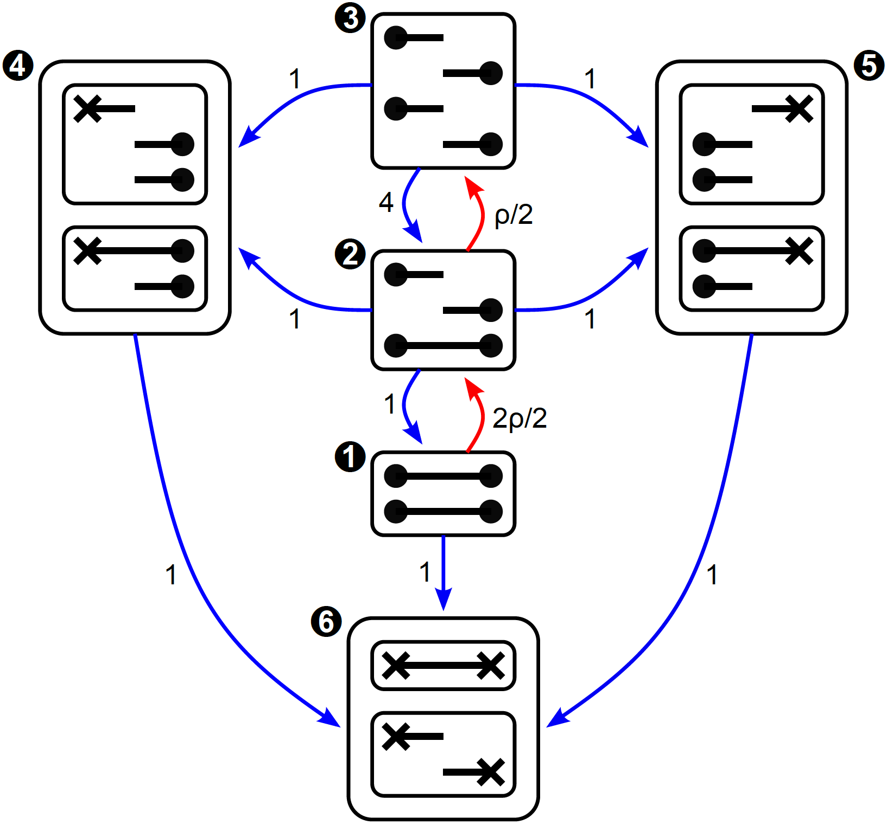
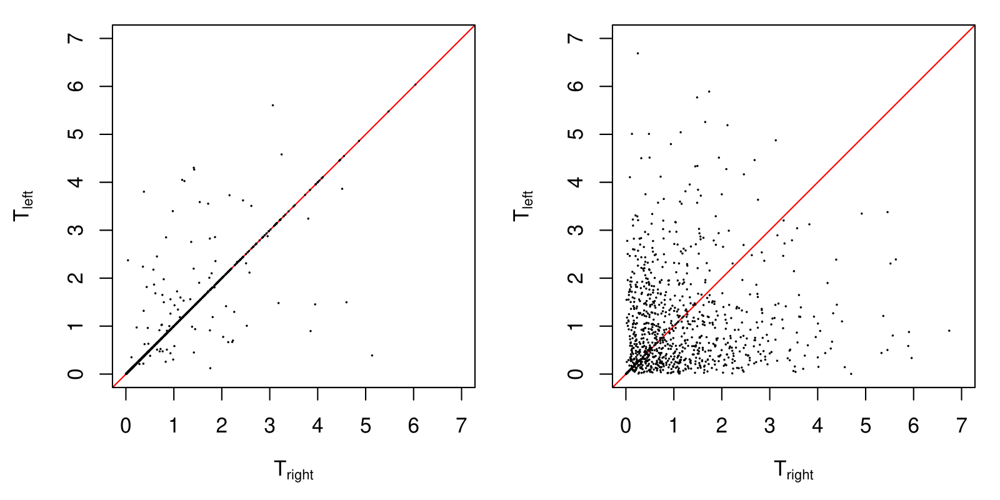

# Summary

Phase-type distributions describe the time until absorption of a continuous or 
discrete-time Markov chain [@bladt2017matrix]. The probabilistic properties of 
phase-type distributions (i.e., the probability density function, cumulative 
distribution function, quantile function, moments and generating functions) 
are well-described and analytically tractable using matrix manipulations. 

Phase-type distributions have been traditionally used in actuarial sciences 
and queuing theory, and more recently in population genetics. In order to 
facilitate the use of phase-type theory in population genetics, we present
`PhaseTypeR`, a general-purpose and user-friendly R package which contains
all key functions &mdash;mean, (co)variance, probability density function, 
cumulative distribution function, quantile function and random sampling&mdash;
for both continuous and discrete phase-type distributions. Importantly, univariate 
and multivariate reward transformations are implemented for continuous and 
discrete phase-type distributions. Multivariate reward transformations are 
crucial for applications in population genetics, and, as to demonstrate this, 
we have included the coalescent with recombination as an example. 

# Statement of need

In recent years, the usefulness of phase-type theory in population genetics has
become evident. Important quantities in population genetics such as the time until the
most recent ancestor, the total tree length, the total number of segregating sites, and 
the site frequency spectrum follow phase-type distributions [@hobolth2019phase]. 
There are already several other R packages that model phase-type distributions, such as
`actuar` [@dutang2008actuar], `mapfit` [@okamura2015mapfit; @okamura_dohi_2015; @okamura_dohi_2016] 
or `matrixdist` [@albrecher_bladt_2019; @AlbrecherBladtYslas2020]. However, these packages only model 
univariate continuous phase-type distributions, they do not include reward transformations,
and they are tailored to actuarial sciences and queuing theory.
 
PhaseTypeR is particularly well suited for population genetics, and much emphasis in our 
software is on natural and easy-to-use R functions. The package has already been used in [@HBA2021] 
to model the site frequency spectrum using multivariate phase-type theory, and we believe that its 
intuitive implementation will encourange more population geneticists to use phase-type
theory. 

# Overview

| Quantity                | Formula                                                                                | Function |
|-------------------------|----------------------------------------------------------------------------------------|----------|
| PH object               | $\tau\sim\text{PH}(\boldsymbol{a}, \boldsymbol{T})$                                    | `PH(T, a)` |
| Mean                    | $\text{E}(\tau)=\boldsymbol{a} (-\boldsymbol{T})^{-1}\boldsymbol{e}$                   | `mean(PH)` |
| Variance                | $\text{V}(\tau)=\text{E}(\tau^2)-\text{E}(\tau)^2$                                     | `var(PH)`  |
| Density                 | $f(x)=\boldsymbol{a}\exp(\boldsymbol{T}x)(\boldsymbol{-T}\boldsymbol{e})$, $x\geq 0$   | `dPH(x, PH)`  |
| Cumulative distribution | $F(x)=1-\boldsymbol{a}\exp(\boldsymbol{T}x)\boldsymbol{e}$, $x\geq 0$                  | `pPH(x, PH)`  |
| Quantile function       |                                                                                        | `qPH(p, PH)`  |
| Random sampling of the time to absorption         |                                                              | `rPH(n, PH)`|
| Random sampling of full path          |                                                                          | `rFullPH(n, PH)` |
| Reward transformation   | See @bladt2017matrix                                                                   | `reward_phase_type(PH, R)` |

Table 1: formulas and corresponding `PhaseTypeR` functions for univariate continuous
phase-type distributions. $\boldsymbol{a}$ and `a` are the vector of initial probabilities, 
$\boldsymbol{T}$ and `T` are the sub-intensity matrix, $\boldsymbol{e}$ is the exit rate
vector, and `R` is the reward vector.

| Quantity                | Formula                                                                                | Function |
|-------------------------|----------------------------------------------------------------------------------------|----------|
| DPH object              | $\tau\sim\text{DPH}(\boldsymbol{a}, \boldsymbol{T})$                                   | `DPH(T, a)` |
| Mean                    | $\text{E}(\tau)=\boldsymbol{\pi} (\boldsymbol{I}-\boldsymbol{T})^{-1}\boldsymbol{e}$   | `mean(DPH)` |
| Variance                | $\text{V}(\tau)= \text{E}(\tau^2)-\text{E}(\tau)^2$                                    | `var(DPH)`  |
| Density                 | $f(x)=\boldsymbol{\pi T}^{x-1}\boldsymbol{t}$, $x\geq 1$                               | `dDPH(x, DPH)`  |
| Cumulative distribution | $F(x)=1-\boldsymbol{\pi T}^x\boldsymbol{e}$, $x\geq 1$                                 | `pDPH(x, DPH)`  |
| Quantile function       |                                                                                        | `qDPH(p, DPH)`  |
| Random sampling of the time to absorption         |                                                              | `rDPH(n, DPH)`|
| Random sampling of full path         |                                                                           | `rFullDPH(n, DPH)`|
| Reward transformation   | See @navarro2019discrete                                                               | `reward_phase_type(DPH, R)` |

Table 2: formulas and corresponding `PhaseTypeR` functions for univariate discrete
phase-type distributions. 

| Quantity                |  Continuous | Discrete |
|-------------------------| ----------| ----------|
| Multivariate phase-type object | `MPH(T, a, R)` | `MDPH(T, a, R)` |
| Mean                    | `mean(MPH)` | `mean(MDPH)` |
| (Co)variance            | `var(MPH)`  | `var(MDPH)`  |
| Density                 | `dMPH(x, MPH)`  | `dMDPH(x, MDPH)`  |
| Cumulative distribution | `pMPH(x, MPH)`  | `pMDPH(x, MDPH)`  |
| Quantile function       | `qMPH(p, MPH)`  | `qMDPH(p, MDPH)`  |
| Random sampling of the time to absorption  | `rMPH(n, MPH)`| `rMDPH(n, MDPH)`|
| Random sampling of full path   | `rFullMPH(n, MPH)` | `rFullMDPH(n, MDPH)` |

Table 3: `PhaseTypeR` functions for multivariate continuous and multivariate
discrete phase-type distributions. For information about the formulas for 
calculating the covariances, please refer to @bladt2017matrix.


# An example: the coalescent with recombination

The traditional procedure for deriving the correlation between the branch lengths in two loci for a sample of size two is by a first-step analysis (e.g., section 7 in @wakeley2009coalescent). In this section, we exemplify the easy use of `PhaseTypeR` to obtain the same result.


The state space and transition rates for the two-locus ancestral recombination graph is shown in Figure 1. The filled circles represent material ancestral to the sample, and the crosses indicate that the most common ancestor has been found. The lines between the circles or crosses indicate if the ancestral material is present on the same chromosome. The starting state is state 1 at present day with two samples from the same chromosome.

The time $\tau$ when both loci have found their common ancestor is $\text{PH}(\boldsymbol{\alpha}, \boldsymbol{S})$ distributed with $\boldsymbol{\alpha}=(1,0,0,0,0)$ and

$$
\begin{equation}
 \boldsymbol{S} = \left( \begin{array}{ccccc}
 -(1+2\rho/2) & 2\rho/2 & 0 & 0 & 0 \\
 1 & -(3+\rho/2) & \rho/2 & 1 & 1 \\
 0 & 4 & -6 & 1 & 1 \\
 0 & 0 & 0 & -1 & 0 \\
 0 & 0 & 0 & 0 & -1 \\
\end{array} \right).
\end{equation}
$$

The tree height $T_{\text{left}}$ in the left locus is the first time the ancestral process $\{X(t):t\geq 0\}$ enters state 4 or state 6 or, equivalently, the time spent in state 1, 2, 3 and 5 before absorption in state 6. We therefore have

$$
\begin{eqnarray*}
  T_{\text{left}}=\min \big\\{ t\geq 0 :X(t)\in\{4,6\} \big\\}=
  \int_0^{\tau}\boldsymbol{r_{\text{left}}}(X_t)dt
\end{eqnarray*}
$$

with the reward vector $\boldsymbol{r_{\text{left}}}=(1,1,1,0,1)$. Similarly, the tree height $T_{\text{right}}$ in the right locus is the first time the ancestral process enters state 5 or state 6 or, equivalently, the time spent in state 1, 2, 3 and 4 before absorption in state 6. We therefore have

$$
\begin{eqnarray*}
  T_{\text{right}}=\min \big\\{ t\geq 0 :X(t)\in\{5,6\} \big\\}=
  \int_0^{\tau}\boldsymbol{r_{\text{right}}}(X_t)dt
\end{eqnarray*}
$$

with the reward vector $\boldsymbol{r_{\text{right}}}=(1,1,1,1,0)$. A classical result in population genetics gives the covariance between the two tree heights

$$
\begin{eqnarray*}
  {\rm Cov}(T_{\text{left}},T_{\text{right}})=\frac{\rho+18}{\rho^2+13\rho+18},
\end{eqnarray*}
$$

and we note that for large recombination rates ${\rm Cov}(T_{\text{left}},T_{\text{right}})$ is close to zero, and for small recombination rates it is close to one. Note that $T_{\text{left}}$ and $T_{\text{right}}$ are both exponentially distributed with a rate of 1, so $\text{Var}(T_{\text{left}})=\text{Var}(T_{\text{right}})=1$, and, consequently,  $\text{Cor}(T_{\text{left}}, T_{\text{right}})=\text{Cov}(T_{\text{left}}, T_{\text{right}})$ (see also equation (3.10) in @wakeley2009coalescent). Moreover, as shown by a simple proof in @wilton2015smc, we have that $P(T_{\text{left}}=T_{\text{right}})=\text{Cov}(T_{\text{left}}, T_{\text{right}})$.



An implementation using `PhaseTypeR` simply consists of specifying the initial distribution, rate matrix for the ancestral process, rewards for the two tree heights, and calling the variance function (`var()`) for the multivariate phase-type distribution.   

```r
recomb_rate <- 0.3
ARG_subint_mat <- function(recomb_rate) {
  matrix(
    c(-(1+2*recomb_rate/2),   2*recomb_rate/2,   0,             0,  0,
        1,                  -(3+recomb_rate/2),  recomb_rate/2, 1,  1,
        0,                    4,                -6,             1,  1,
        0,                    0,                 0,            -1,  0,
        0,                    0,                 0,             0, -1),
    nrow=5, byrow=TRUE)
}
subintensity_matrix <- ARG_subint_mat(recomb_rate)
initial_probabilities <- c(1, 0, 0, 0, 0)
# T_left: T_MRCA in left locus
reward_left <- c(1, 1, 1, 0, 1)
# T_right: T_MRCA in right locus
reward_right <- c(1, 1, 1, 1, 0)
# Joint distribution T_joint of T_left and T_right
T_joint <- MPH(subintensity_matrix,
               initial_probabilities,
               matrix(c(reward_left, reward_right), nrow = 5))
var(T_joint)[1, 2]
```
```
[1] 0.8321965
```

We can see that the phase-type result is equal to the classical formula provided above when $\rho=0.3$. 

From this multivariate phase-type representation of the ancestral recombination graph (ARG), we can simulate, for example, 1,000 draws from the joint distribution of $(T_{\text{left}}, T_{\text{right}})$ using `rMPH(1000, T_joint)` in `PhaseTypeR`. If the recombination rate $\rho$ is set to a small value, then most of the draws will result in $T_{\text{left}}=T_{\text{right}}$, and the joint density will concentrate along the diagonal, as shown in Figure 2, left (@simonsen1997markov). If instead $\rho$ is large, then most of the draws will result in $T_{\text{left}}\neq T_{\text{right}}$ (Figure 2, right).

```r
## Simulation from the joint distribution
subintensity_matrix_09 <- ARG_subint_mat(0.166)
Tab_09 <- MPH(subintensity_matrix_09, initial_probabilities,
              matrix(c(reward_left, reward_right), nrow=5))
subintensity_matrix_01 <- ARG_subint_mat(11.316)
Tab_01 <- MPH(subintensity_matrix_01, initial_probabilities,
              matrix(c(reward_left, reward_right), nrow=5))
set.seed(3)
rTab_09 <- rMPH(1000, Tab_09)
rTab_01 <- rMPH(1000, Tab_01)
```



# References
