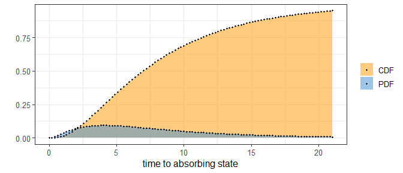

```{r, include = FALSE}
knitr::opts_chunk$set(
  collapse = TRUE,
  comment = "#>",
  fig.align = "center"
)
```

```{r, setup, include = FALSE}
library(phasty)
```

# Informations
Please report any issues on [the git page of the package](https://github.com/rivasiker/phasty)

Most informations and details can be find in the book of Bladt and Nielsen [-@Bladt2017]: Matrix-Exponential Distributions in Applied Probability
and the PhD of Campillo Navarro [-@Navarro2019]


# 1. Introduction

Phase-type distributions are great mathematical tool especially in fields like insurance or population genetics.

The basic idea is considering a markov jump process (or a Markov chain for discrete cases) with $n$ transient states and 1 absorbing state (i.e. once in the absorbing state, it cannot go out), you can have the time before reaching that absorbing state using the intensity matrix and the initial probabilities to start in each state. The matrix form of phase-type distribution allow great simplification, in particular to find the moments of the time before reaching 
the absorbing state.

The package ```phasty``` handle this phase-type distribution and the calculation behind it.

This package is a complete as possible, nevertheless, it stays a package which bring mathematical tools and its not oriented for a specific application. 


# 2. The phase-type S3 class objects

The functions provided by ```phasty``` require objects of class ```disc_phase_type```, ```cont_phase_type```, ```mult_disc_phase_type``` or ```mult_cont_phase_type```, which can be obtain using the generator function ```phase_type()```. here is an example considering a univariate continuous phase-type distribution:

```{r phase_type()_example}
subintensity_matrix <- matrix(c(-1.5, 0, 0,
                              1.5, -1, 0,
                              0, 1, -0.5), ncol = 3)
initial_probabilities <- c(0.9, 0.1, 0)
ph <- phase_type(subintensity_matrix, initial_probabilities)

print(ph)
```

Where ```subint_mat``` is the subintensity matrix and ```init_probs``` is the vector of initial probabilities. 
An object of one of the ```phase_type``` class always has a subintensity matrix, a initial probability vector, a defect (the probability of starting directly in the absorbing state, which can happen when using reward transformation (see section \)), and the type of class. We can also print a summary of the object:

```{r}
summary(ph)
```


The ```init_probs``` argument is optional, and in case of not providing it the probability of the first state will be set to 1, this is, $\boldsymbol{\pi} = (1,\, 0,\, 0,\, ...\,,0)$. If this is the case, ```phase_type()``` will print a warning:

```{r}
subintensity_matrix <- matrix(c(-1.5, 0, 0,
                              1.5, -1, 0,
                              0, 1, -0.5), ncol = 3)
phase_type(subintensity_matrix)
```


# 3. The univariate distribution

## 3.1. The continuous univariate phase-type

Consider $\{X_t\}_{t\ge0}$ to be a  <span style="color:orange"> **Markov jump process (MJP)** </span>  with $n$ transient states and 1 absorbing state. If $\tau$ is defined as time where $\{X_t\}_{t\ge0}$ reaches the absorbing state, then $\tau$ follows a continuous phase-type distribution $\tau \sim PH(\boldsymbol{T}, \boldsymbol{\pi})$, where $\boldsymbol{T}$ is the subintensity matrix of the corresponding MJP and $\boldsymbol{\pi}$ is the vector of starting probabilities.

As specified before, a continuous phase-type distribution object can be created in ```phasty``` using the ```phase_type()``` function:

```{r cont_example}
subintensity_matrix <- matrix(c(-1.5, 0, 0,
                              1.5, -1, 0,
                              0, 1, -0.5), ncol = 3)
initial_probabilities <- c(0.9, 0.1, 0)

ph <- phase_type(subintensity_matrix, initial_probabilities)

print(class(ph)) 
```


Given the formulas from **theorem 3.1.16** and **corollary 3.1.18** [@Bladt2017 page p.135], the mean of a variable following a continuous phase-type distribution is define as:

$$
\mathbb{E} (\tau) = \boldsymbol{\pi U e} = \boldsymbol{\pi} (-\boldsymbol{T})^{-1} \boldsymbol{e}
$$
and from **corollary 3.1.18** [@Bladt2017 page p.], the expectation of $\tau^n$ is defined as:

$$
\mathbb{E} (\tau^n) = n!\boldsymbol{\pi} (-\boldsymbol{T})^{-n} \boldsymbol{e}
$$

From these two formulas we can derive the variance of $\tau$ as:

$$
\mathbb{V} (\tau) = (2\boldsymbol{\pi} (-\boldsymbol{T})^{-2} \boldsymbol{e})
-(\boldsymbol{\pi} (-\boldsymbol{T})^{-1} \boldsymbol{e})^2
$$

Calculating the mean and variance of phase-type distributions is straightforward in ```phasty```. We can do so by using the generic functions  ```mean()``` and ```var()``` on a ```cont_phase_type``` object. For example:


```{r mean_var_cont, collapse = TRUE}
cat('\n', 'Mean: ',mean(ph),'\n')
cat(' Variance: ',var(ph),'\n \n')
```

These two quantitites are also printed when using the `summary()` function:

```{r}
summary(ph)
```


**The probability density function** (PDF) of a continuous phase-type distribution is defined by **equation 3.1.7** [@Bladt2017 page p.131]:

$$
f(u) = \boldsymbol{\pi}e^{\boldsymbol{T}u}\boldsymbol{t}
$$
where $\boldsymbol{t} = -\boldsymbol{T}\boldsymbol{e}$ is the exit rate of the subintensity matrix (the vector of transition from state $i$ to the absorbing state). From there we can get the **cumulative distribution function** (CDF) as:

$$ 
F(u) = 1-\boldsymbol{\pi}e^{\boldsymbol{T}u}\boldsymbol{e}
$$

We can easily calculate the PDF and the CDF with `dphtype()` and `pphtype()` respectively:

```{r plot_cont}
x <- seq(0, qphtype(0.95, ph), length.out = 100)
pdf <- dphtype(x, ph)
cdf <- pphtype(x, ph)


plot(x, cdf, xlab = "Time to absorbing state", ylab = "", col = "orange", type = 'l')
lines(x, pdf, col = "blue")
title('PDF and CFD')
legend(6, 0.4, legend=c('PDF', 'CDF'),
       col=c("orange", "blue"), lty=1)
```


Additionally, we can compute the quantile function using `qphtype()`:

```{r}
x <- seq(0.05, 0.95, 0.01)
plot(x, qphtype(x, ph), col = "orange", 
     ylab = "Time to absorbing state", xlab = "Quantile")
title('Quantile function')
```


We can also create random draws from the phase-type distribution by using `rphtype()`:

```{r}
cat('10 random samples: \n', rphtype(5, ph), '\n', rphtype(5, ph))
```


```{r cont_ggplot, echo=FALSE, out.width = '70%'}

# knitr::include_graphics("pic/cont_ggplot.jpg")

```

```{r cont_quantile_ggplot, echo=FALSE, out.width = '70%'}

# knitr::include_graphics("pic/cont_quantile_ggplot.jpg")

```


## 3.2. The discrete univariate phase-type

Instead of using a MJP (also called continuous Markov chain), it is also possible to consider a <span style="color:orange"> **Markov chain (MC)** </span>. Let's consider $\tau \sim DPH(\boldsymbol{T}, \boldsymbol{\pi})$, where $\tau \in \mathbb{N}$. $\tau$ will represent the number of states visited before entering the absorbing state. For that reason, the subintensity matrix $\boldsymbol{T}$ will not contain rates, but rather the probability of jumping from one state to another. 

Discrete phase-type distributions can be created in `phasty` using the very same `phase_type()` function used for the continuous case, but specifying a subintensity matrix that meets the requirements for a discrete phase-type distribution:

```{r disc_example}
subintensity_matrix <- matrix(c(0, 0.2, 0.8,
                              0.5, 0.5, 0,
                              0, 0, 0.4), ncol = 3, byrow = T)
initial_probabilities <- c(0.7, 0.3, 0)
dph <- phase_type(subintensity_matrix, initial_probabilities)

print(class(dph))
```

As for the continuous phase-type, it is possible to describe any moment using the factorial moment using describe in  **proposition 2.7.iii** [@Navarro2019 page p.12]

$$
\mathbb{E} (\tau(\tau - 1) ... (\tau-(n-1))) = n!\boldsymbol{\pi T}^{n-1} (\boldsymbol{I}-\boldsymbol{T})^{-n} \boldsymbol{e}
$$

This leads to a mean and variance given by:

$$
 \mathbb{E} (\tau) = \boldsymbol{\pi}(\boldsymbol{I}-\boldsymbol{T})^{-1}\boldsymbol{e} \\
 \mathbb{V} (\tau) = 2\boldsymbol{\pi}\boldsymbol{T}(\boldsymbol{I}-\boldsymbol{T})^{-2}\boldsymbol{e} + \mathbb{E} (\tau) - \mathbb{E} (\tau)^2
$$

In ```phasty``` the mean and variance of a discrete phase-type distribution can be reached using the generic functions `mean()` and `var()`:

```{r mean_var_disc}
cat('\n', 'Mean: ',mean(dph),'\n')
cat(' Variance: ',var(dph),'\n \n')
```

On the other hand, **theorem 1.2.58 and 1.2.59** [@Bladt2017 page p.30] shows respectively that the density of a discrete phase-type distributed variable is

$$
f_\tau(n) = \boldsymbol{\pi T}^{n-1}\boldsymbol{t}
$$

and its distribution function is

$$
F_\tau(n) = 1-\boldsymbol{\pi T}^{n}\boldsymbol{e}
$$

As for the continuous case, it is possible to build this distribution by using the same set of functions:

```{r plot_disc}
x <- seq(0, qphtype(0.95, dph), 1)
pmf <- dphtype(x, dph)
cdf <- pphtype(x, dph)

data <- cbind(cdf, pmf)
barplot(t(data), xlab = "Time to absorbing state", col = c("orange","blue"), beside = T)
title('Density and distribution functions')
legend(2, 0.7, legend=c('PDF', 'CDF'),
       col=c("orange", "blue"), lty=1)

x <- seq(0.05, 0.95, 0.01)
plot(x, qphtype(x, dph), col = "orange", ylab = "Time to absorbing state", xlab = "Quantile")
title('Quantile function')
```

```{r disc_ggplot, echo=FALSE, out.width = '70%'}

# The following plots have been designed using ggplot2
# knitr::include_graphics("pic/disc_ggplot.jpg")

```

```{r disc_quantile_ggplot, echo=FALSE, out.width = '70%'}

# knitr::include_graphics("pic/disc_quantile_ggplot.jpg")

```

## 3.3. The reward transformation

A reward transformation allows to give a weights to each state. Those weights should be non-negative (but they can be zero). 

### 3.3.1 Positive rewards for continuous phase-type distribution

Considering $\tau \sim PH(\boldsymbol{T}, \boldsymbol{\pi})$ with $\{X_t\}_{t \ge 0}$ the underlying Markov jump process, and the reward vector $\boldsymbol{r} = (r_1,\ r_2,\ ...\,,\ r_n) \in \mathbb{R}^p_+$.

We can then set the new variable:

$$
 Y = \int^\tau_0 r(X_t)dt
$$

which corresponds to the weighted time before absorption (or the reward earned until absorption). Given **theorem 3.1.33** [@Bladt2017], this new variable also follows a continuous phase-type distributed that can be described as:

$$
Y \sim PH(\boldsymbol{T}^\star, \boldsymbol{\pi}^\star)
$$

Deriving $\boldsymbol{T}^\star$ and $\boldsymbol{\pi}^\star$ is rather simple if the given rewards only contain positive values, in that case, the rates are divided by the corresponding rewards ($\boldsymbol{T}^\star$ = $\boldsymbol{Tr}$) and the initial probabilities are not modified ($\boldsymbol{\pi}^\star$ = $\boldsymbol{\pi}$).

Taking the previous example and applying a reward vector $\boldsymbol{r} = (1,\ 2,\ 3)$, the continuous phase-type distribution can easily be reward-transformed in `phasty` using `reward_phase_type()`:

```{r reward_disc}
rph <- reward_phase_type(ph, c(1, 2, 3))
print(rph)
```

```{r}
x <- seq(0, qphtype(0.95, rph), length.out = 100)
pdf <- dphtype(x, rph)
cdf <- pphtype(x, rph)


plot(x, cdf, xlab = "Time to absorbing state", ylab = "", col = "orange", type = 'l')
lines(x, pdf, col = "blue")
title('Density and distribution functions')
legend(15, 0.6, legend=c('PDF', 'CDF'),
       col=c("orange", "blue"), lty=1)
```

```{r reward_cont_ggplot, echo=FALSE, out.width = '70%'}
# 
```

### 3.3.2. Positive rewards for discrete phase-type distribution

In discrete phase-type distribution, the reward transformation can be achieved using intermediate states as presented by Navarro [-@Navarro2019]. 

Considering $\tau \sim DPH(\boldsymbol{T}, \boldsymbol{\pi})$ with $\{X_n\}_{n \ge 0}$ the underlying Markov chain, and the reward vector  $\boldsymbol{r} = (r_1,\ r_2,\ ...\,,\ r_p) \in \mathbb{N}$. As for the continuous phase-type:

$$
Y = \sum_{n=0}^{\tau - 1} r(X_n)
$$

Using the same discrete phase-type distribution as before, we can reward-transform the distribution using $\boldsymbol{r} = (1,\ 2,\ 3)$:

```{r}
rdph <- reward_phase_type(dph, c(1, 2, 3))
print(rdph)
```

```{r}
x <- seq(0, qphtype(0.95, rdph), 1)
pmf <- dphtype(x, rdph)
cdf <- pphtype(x, rdph)

data <- cbind(cdf, pmf)
barplot(t(data), xlab = "Time to absorbing state", col = c("orange","blue"), beside = T)
title('Density and distribution functions')
legend(1, 0.7, legend=c('PDF', 'CDF'),
       col=c("orange", "blue"), lty=1)
```

```{r reward_disc_ggplot, echo=FALSE, out.width = '70%'}
# knitr::include_graphics("pic/reward_disc_ggplot.jpg")
```

### 3.3.3. Dealing with zero rewards

To perform a reward transformation with at least one reward of zero, it is necessary to transform the subintensity matrix and initial probabilities by removing the zero rewarded state and then apply the positive rewards on the remaining states. 

**Theorem 3.1.33** [@Bladt2017 page p.147] describes the intermediates matrix $\boldsymbol{P}$ define by 

$$
\boldsymbol{P} = \boldsymbol{Q}^{++} + \boldsymbol{Q}^{+0} \, (\boldsymbol{I} - \boldsymbol{Q}^{+0})^{-1} \ \boldsymbol{Q}^{0+}
$$

Where $\boldsymbol{Q}$ is the reorganization of $\boldsymbol{T}$ which gives:

$$
\boldsymbol{Q} =
\left(\begin{array}{cc} 
\boldsymbol{Q}^{++} & \boldsymbol{Q}^{+0}\\
\boldsymbol{Q}^{+0} & \boldsymbol{Q}^{00}
\end{array}\right)
$$

The superscripts of the sub-matrices represent whether the states have positive (+) or null (0) rewards. For example, $\boldsymbol{Q}^{0+}$, is the sub-matrix which gathers the transition rates from states with a reward of zero to states with a positive reward. Also from a phase-type perspective, for any $\tau \sim PH(\boldsymbol{T}, \boldsymbol{\pi})$ then $\tau \sim PH(\boldsymbol{Q}, \boldsymbol{\rho})$, where $\rho$ represents reordered initial probabilities. 

Let's apply a reward of $\boldsymbol{r} = (0,\ 2,\ 3)$ to the example discrete phase-type example. We can do it in two separate steps. First, we will remove those states with a null reward:

```{r}
zero_dph <- reward_phase_type(dph, c(0, 1, 1))
print(zero_dph)
```

Because of the computational approximation on matrix calculation, the defect is slightly positive but it is effectively zero.

Then, the positive rewards can be applied to each of the remaining states to create a new discrete phase-type distribution:

```{r}
reward_phase_type(zero_dph, c(2, 3))
```

These two steps can be unified into the same line of code by directly specifying the $\boldsymbol{r} = (0,\ 2,\ 3)$ reward vector:

```{r, echo = F}
reward_phase_type(dph, c(0, 2, 3))
```

The same function can be used for continuous phase-type distributions:

```{r}
reward_phase_type(ph, c(0, 2, 3))
```


### 3.3.4. The variable reward in discrete phase-type

Recently unpusblished results from A. Hobolth et al. leads to think at an expansion of the reward for DPH. At each arrival in a new state the reward of this state is randomly chosen using a vector of probability 
Applying variable reward in the discrete case is relatively easy because of the construction of the reward transformation in discrete phase-type.

Consider the previous example and we want for state 1 a reward of 2 with probability 0.5 of state and a reward of 1 with probability 0.5, which would lead to

$$
\boldsymbol{T} = 
\begin{bmatrix}
0 & 1 & 0 & 0 \\
0 & 0 & 0.2 & 0.8 \\
0.25 & 0.25 & 0.5 & 0 \\
0 & 0 & 0 & 0.4
\end{bmatrix}
$$

$$
\boldsymbol{\pi} = (0.35,\ 0.35,\ 0.3,\ 0)
$$

In phasty this can be computed using a matrix of probability rather than a vector. Note that this matrix is not the same as in the ```phase_type()``` function, since the ```disc_phase_type``` object stays univariate.


# 4. The multivariate phase-type distribution

## 4.1. The continuous multivariate phase-type

For further details see **section 8.1** [@Bladt2017 page p.438].

Let $\tau \sim PH(\boldsymbol{T}, \boldsymbol{\pi})$ with $\{X_t\}_{t \ge 0}$ the underlying Markov jump process and $\boldsymbol{R}$ a matrix of size $p\times n$, then the variable $\boldsymbol{Y} \sim MPH^*_p(\boldsymbol{T},\  \boldsymbol{\pi},\  \boldsymbol{R})$ is the vector $\boldsymbol{Y} = (Y_1,\  Y_2,\  ...\,,\  Y_n)$ where $Y_i$ will correspond to

$$
Y_j = \int_0^\tau r_j(X_t)dt
$$
i.e. the reward transformation of $\boldsymbol{T}$ and $\boldsymbol{\pi}$ using $r_j$.

Using the ```phase_type()``` function with the reward matrix in the ```reward_mat``` parameter

```{r}
R <- matrix(c(0, 1, 1,
              2, 1, 5, 
              0, 1, 10), ncol = 3)
mph <- phase_type(ph$subint_mat, ph$init_probs, reward_mat = R)
print(mph)
```

### 4.1.1 The moments

From **theorem 8.1.5** [@Bladt2017 page p.440], the bivariate moment of an $MPH^*$ distributed variable is given by

$$
    \mathbb{E}(Y_j Y_k) = \boldsymbol{\pi U \Delta}(\boldsymbol{r}_j)\boldsymbol{Ur}_k + \boldsymbol{\pi U \Delta}(\boldsymbol{r}_j)\boldsymbol{Ur}_i
$$

and from there it is easy to reach the covariance using

$$
\mathrm{Cov} = \mathbb{E}(Y_j Y_k) - \mathbb{E}(Y_j)\mathbb{E}(Y_k)
$$

These two metrics can be computed in ```phasty``` using ```var```, which gives the covariance matrix:

```{r}
var(mph)
```

and ```mean```, which gives the mean of each reward transformation:

```{r}
mean(mph)
```

## 4.2 The discrete multivariate phase-type

The discrete phase-type distribution is really similar to the continuous one  with more details available in **section 5.2** [@Navarro2019 page p.79]. The same construction as for the continuous will be use so we can just write  $\boldsymbol{Y} = (Y_1,\  Y_2,\  ...\,,\  Y_n)$ where $Y_i$ will corresponds to

$$
Y_j = \sum_0^n r_j(X_n)
$$
Using the ```phase_type()``` function with the reward matrix in the ```reward_mat``` parameter

```{r}
R <- matrix(c(0, 1, 1,
              2, 1, 5, 
              0, 1, 10), ncol = 3)
mdph <- phase_type(dph$subint_mat, dph$init_probs, reward_mat = R)
print(mdph)
```

### 4.2.1 The moments

From **Proposition 5.7** [@Navarro2019 page p.85] we get that the cross moment in the bivariate case is:

$$
\mathbb{E}(Y_j Y_k) = \boldsymbol{\pi} \left\{\boldsymbol{U\Delta}(\boldsymbol{r}_j)\boldsymbol{U\Delta}(\boldsymbol{r}_k) + \boldsymbol{U\Delta}(\boldsymbol{r}_k)\boldsymbol{U\Delta}(\boldsymbol{r}_j) - \boldsymbol{U\Delta}(\boldsymbol{r}_j)\boldsymbol{\Delta}(\boldsymbol{r}_k)\right\}\boldsymbol{e}.
$$

and the covariance is given by:

$$
\mathrm{Cov}(Y_j,\,Y_k) = \boldsymbol{\pi} \left\{\boldsymbol{U\Delta}(\boldsymbol{r}_j)\boldsymbol{U\Delta}(\boldsymbol{r}_k) + \boldsymbol{U\Delta}(\boldsymbol{r}_k)\boldsymbol{U\Delta}(\boldsymbol{r}_j) \\- \boldsymbol{U\Delta}(\boldsymbol{r}_j)\boldsymbol{\Delta}(\boldsymbol{r}_k) - \boldsymbol{U\Delta}(\boldsymbol{r}_j)\boldsymbol{e\pi U\Delta}(\boldsymbol{r}_k) \right\}\boldsymbol{e}.
$$

which can be computed in ```phasty``` using the ```var()``` which gives the covariance matrix

```{r}
var(mdph)
```

and ```mean()``` gives the mean of each reward transformation

```{r}
mean(mdph)
```


# Additional functions

## Get one simulation from a phase-type

To get one simulation of the corresponding MC or MJP from a discrete or continuous phase-type distribution respectively, the function ```sim_phase_type(obj, R = 100)``` can be called. With obj an object of the class from ```phasty``` and R the number of simulation.

The output will be a list with (`[[1]]`) the vector of the number of step (MC) or spending time (MJP) and (`[[2]]`) the vector of corresponding state visited . 

```{r}
set.seed(42)
sim_phase_type(ph)
set.seed(42)
sim_phase_type(dph)
```


TODO CODE CORRECTIONS NOT MC NOW
For a reward transform MC we advise to use the ```sim_rew_phase_type()``` function, because the reward transformation add intermediate states which will be count in the simulation as separate state. Note that this function can also be use for ```cont_phase_type``` object but the ouput will be the same as using ```sim_phase_type()``` with a pretransformed MJP.

```{r}
set.seed(42)
#sim_rew_phase_type(1, ph, c(1,2,3))
set.seed(42)
#sim_rew_phase_type(1, dph, c(1,2,3))
```


## approximation of the CDF (for negative reward)

##

# References

